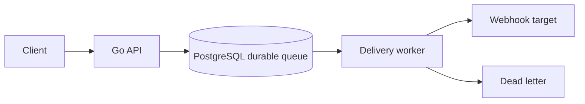

# webhook-relay

外部サービスへのWebhook配信を、冪等性・署名・再送・デッドレターを前提に扱う小さな配信基盤です。APIとワーカーはGo、管理画面はNext.jsに拡張できる境界で構成します。

## 起動

```bash
go test ./...
go run ./cmd/relay
curl http://localhost:4201/health
```

## API

- `POST /v1/endpoints` — URLとsecretを登録
- `POST /v1/messages` — `Idempotency-Key`で重複受付を防止
- `GET /v1/deliveries` — 配信履歴
- `POST /v1/deliveries/{id}/replay` — 手動再送

署名はHMAC-SHA256を使い、配信ワーカーはタイムアウト、指数バックオフ、最大試行回数、デッドレター遷移を担当します。



## 検証

```bash
go test ./...
pnpm test
```
